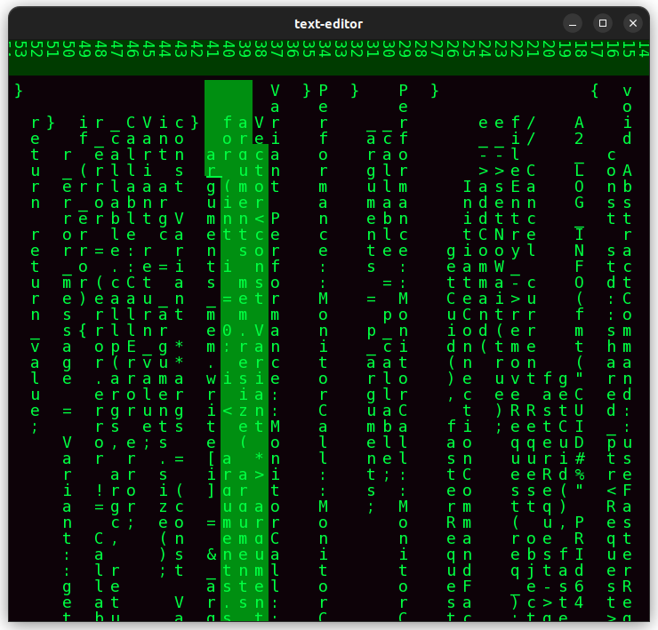

# text-editor

Forked from [JonSeijo/text-editor](https://github.com/JonSeijo/text-editor).

## Matrix Mode

A fun feature developed by [me](https://github.com/alanzhu39). Editor mode that displays text with a classic Matrix-esque code appearance. Lines are written vertically from top to bottom, left to right.



Maintains all existing functionality, and mouse and arrow key cursor control are updated to work intuitively. Activate by adding the `--matrix-mode` argument in the command line:

```
./editor <filename> --matrix-mode
```

## About

Text editor made in C++ using SFML

This is a simple text editor made from scratch in C++. (Using SFML for window drawing)
Yes, thats it. Nothing fancy, nothing weird. Just a great learning experience.


The editor is functional, you can write text, delete it, select it (keyboard AND mouse support). It has some nice features like swapping text lines.


----

## Compiling instructions

The editor uses SFML library as graphics controller, so it is needed for compiling. IMPORTANT: Needs version +2.4 !!
See https://www.sfml-dev.org

A working Makefile is included, works great assuming you have sfml installed correctly.

```
make && ./editor
```

## Warning!

Be careful with the data you save!


## F.A.Q.


## Notes

DejaVuSansMono.ttf
https://dejavu-fonts.github.io/

FreeMono.ttf
http://font.ubuntu.com/ufl/ubuntu-font-licence-1.0.txt

SFML 2.4
https://www.sfml-dev.org
